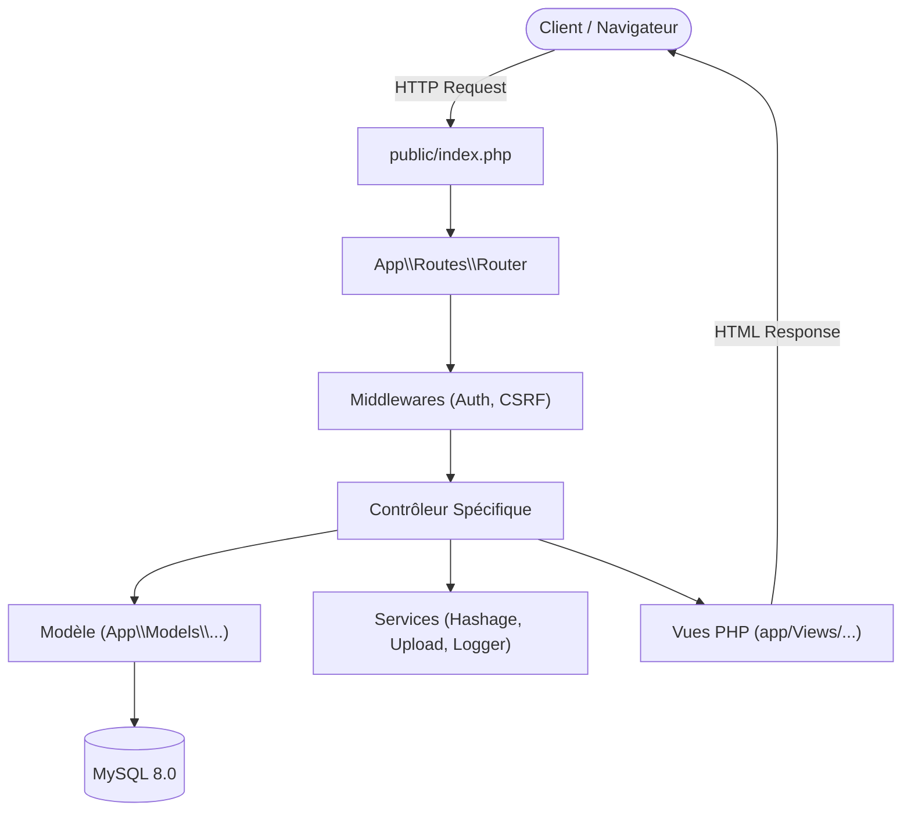
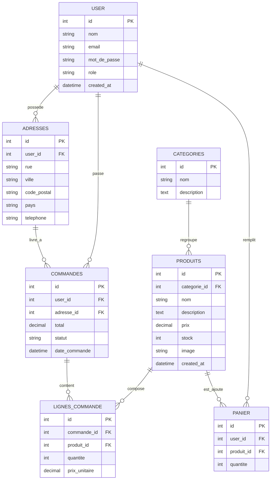

# 🏛️ Architecture du Projet

Ce document présente les choix d'architecture logicielle, la structure des modules, le cycle de vie d'une requête et le modèle de données de l'application **Boutique E-commerce PHP 8.3**.

---

## 1. Vue d'Ensemble & Patron MVC

L'application est conçue selon le patron de conception **Modèle - Vue - Contrôleur (MVC)** sans dépendre d'un framework tiers, garantissant une maîtrise totale du code, une légèreté maximale et une excellente maintenabilité.



---

## 2. Arborescence du Code Source

```text
├── .github/
│   └── workflows/
│       └── ci.yml               # Pipeline d'intégration continue GitHub Actions
├── app/
│   ├── Controllers/             # Contrôleurs MVC
│   │   ├── AddressesController.php
│   │   ├── CommandeController.php
│   │   ├── Controller.php       # Contrôleur de base avec méthode render()
│   │   ├── LigneCommandeController.php
│   │   ├── PanierController.php
│   │   ├── ProduitsController.php
│   │   └── UserController.php
│   ├── Middleware/              # Filtres et intercepteurs de requêtes
│   │   ├── Authentification.php
│   │   └── Csrf.php
│   ├── Models/                  # Couche d'accès aux données (PDO)
│   │   ├── Addresse.php
│   │   ├── Categorie.php
│   │   ├── Commande.php
│   │   ├── LigneCommandes.php
│   │   ├── Panier.php
│   │   ├── Produits.php
│   │   └── User.php
│   ├── Routes/
│   │   └── Router.php           # Moteur de routage et Injection de Dépendances
│   ├── Services/                # Services métier transverses
│   │   ├── Hashage.php          # Chiffrement et vérification des mots de passe
│   │   └── UploadFiles.php      # Validation et stockage des fichiers images
│   ├── Utils/                   # Utilitaires système
│   │   ├── AppLogger.php        # Wrapper Monolog centralisé
│   │   └── Csrf.php             # Gestion des jetons anti-CSRF
│   └── Views/                   # Templates d'affichage HTML
│       ├── adresses/
│       ├── commandes/
│       ├── panier/
│       ├── produits/
│       ├── login.php
│       ├── profile.php
│       └── register.php
├── config/
│   └── MysqlDatabase.php        # Connexion PDO MySQL & chargement Dotenv
├── docker/
│   └── init.sql                 # DDL de création des tables et jeu de données initial
├── logs/                        # Dossier des journaux d'audit (app.log)
├── public/                      # Racine web publique (DocumentRoot Apache)
│   ├── .htaccess                # Règles de réécriture d'URL
│   ├── index.php                # Front Controller unique
│   └── uploads/                 # Répertoire des images téléversées
├── test/                        # Suite de tests automatisés PHPUnit
│   ├── AddresseTest.php
│   ├── AppLoggerTest.php
│   ├── CategorieTest.php
│   ├── CommandeTest.php
│   ├── CsrfTest.php
│   ├── DatabaseTest.php
│   ├── FunctionalTest.php
│   ├── HashageTest.php
│   ├── ProduitTest.php
│   ├── RouterTest.php
│   └── UserTest.php
├── .dockerignore
├── .gitignore
├── composer.json
├── composer.lock
├── docker-compose.yml
├── Dockerfile
└── phpunit.xml
```

---

## 3. Le Moteur de Routage et l'Injection de Dépendances

Le composant central [`App\Routes\Router`](file:///c:/Users/Beauchard/Documents/exercicesCS\PHP\project\app\Routes\Router.php) implémente des fonctionnalités avancées :

### 1. Résolution dynamique des URL avec expressions régulières
Les routes parametrées (ex: `/produits/modifier/{id}`) sont transformées en motifs regex `^/produits/modifier/([^/]+)$`.

### 2. Typage strict et transtypage par Réflexion
Sous `declare(strict_types=1);`, les paramètres extraits de l'URL (qui sont nativement des chaînes) sont automatiquement inspectés via `ReflectionMethod` :
* Si la méthode du contrôleur attend un paramètre `int $id`, la valeur est convertie en `(int) $val`.
* Si elle attend un `float $val`, elle est convertie en `(float) $val`.

### 3. Résolution récursive des dépendances
La méthode `resolveController(string $controllerClass)` inspecte le constructeur de la classe demandée et instancie automatiquement ses dépendances :
* Si le constructeur réclame une instance `PDO`, l'instance de base de données lui est fournie.
* Si un contrôleur réclame un modèle (ex: `User`, `UploadFiles`), le routeur instancie la classe correspondante et injecte la connexion requise.

---

## 4. Modèle Relationnel de Données (MCD / MLD)



---

## 5. Standard de Typage et Qualité

Le projet applique une rigueur absolue :
* **100% des fichiers** PHP débutent par `declare(strict_types=1);`.
* Toutes les propriétés, paramètres de méthodes et types de retour sont rigoureusement déclarés (`string`, `int`, `float`, `array`, `void`, `?int`).
* Couverture de test complète : 54 tests automatisés PHPUnit couvrant la totalité des cas nominaux et d'erreur.
