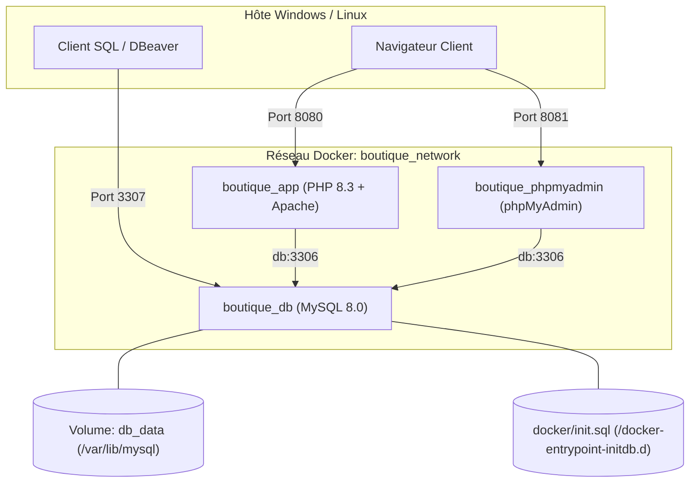

# 🐳 Guide Docker et Orchestration

Ce document présente l'architecture de conteneurisation de l'application **Boutique E-commerce PHP 8.3**, le fonctionnement du `Dockerfile` et l'orchestration multi-conteneurs avec `docker-compose.yml`.

---

## 1. Architecture des Conteneurs

L'environnement repose sur une pile de trois conteneurs isolés et reliés par un réseau bridge privé dédié (`boutique_network`) :



| Conteneur | Image de base | Port Hôte | Port Interne | Rôle |
| :--- | :--- | :--- | :--- | :--- |
| **`boutique_app`** | Custom ([`Dockerfile`](file:///c:/Users/Beauchard/Documents/exercicesCS/PHP/project/Dockerfile)) | `8080` | `80` | Application MVC PHP 8.3 sous Apache |
| **`boutique_db`** | `mysql:8.0` | `3307` | `3306` | Base de données relationnelle MySQL |
| **`boutique_phpmyadmin`** | `phpmyadmin:latest` | `8081` | `80` | Interface web d'administration de la BDD |

> [!NOTE]
> **Pourquoi le port hôte 3307 ?**  
> Si vous utilisez WampServer, XAMPP ou un serveur MySQL local sur votre machine hôte, le port standard `3306` est déjà occupé. La redirection `3307:3306` permet d'éviter l'erreur `ports are not available: 500`. À l'intérieur du réseau Docker, les services communiquent toujours sur le port standard `db:3306`.

---

## 2. Analyse détaillée du [`Dockerfile`](file:///c:/Users/Beauchard/Documents/exercicesCS/PHP/project/Dockerfile)

```dockerfile
FROM php:8.3-apache

# 1. Dépendances système
RUN apt-get update && apt-get install -y \
    libzip-dev zip unzip \
    && rm -rf /var/lib/apt/lists/*

# 2. Extensions PHP obligatoires (PDO MySQL)
RUN docker-php-ext-install pdo pdo_mysql

# 3. Activation de mod_rewrite pour le routage MVC
RUN a2enmod rewrite

# 4. Configuration du DocumentRoot vers public/
ENV APACHE_DOCUMENT_ROOT=/var/www/html/public
RUN sed -ri -e 's!/var/www/html!${APACHE_DOCUMENT_ROOT}!g' /etc/apache2/sites-available/*.conf \
    && sed -ri -e 's!/var/www/!${APACHE_DOCUMENT_ROOT}!g' /etc/apache2/apache2.conf /etc/apache2/conf-available/*.conf

# 5. Autorisation du fichier .htaccess (AllowOverride All)
RUN sed -i '/<Directory \/var\/www\/>/,/<\/Directory>/ s/AllowOverride None/AllowOverride All/' /etc/apache2/apache2.conf

# 6. Répertoire de travail
WORKDIR /var/www/html

# 7. Copie des fichiers applicatifs
COPY . /var/www/html/

# 8. Droits d'écriture pour l'utilisateur Apache www-data
RUN mkdir -p /var/www/html/public/uploads /var/www/html/logs \
    && chown -R www-data:www-data /var/www/html/public/uploads /var/www/html/logs \
    && chown -R www-data:www-data /var/www/html/app

EXPOSE 80
CMD ["apache2-foreground"]
```

---

## 3. Analyse détaillée de [`docker-compose.yml`](file:///c:/Users/Beauchard/Documents/exercicesCS/PHP/project/docker-compose.yml)

### Points clés de configuration :
1. **Healthcheck MySQL** : Empêche l'application PHP de démarrer tant que le moteur MySQL n'est pas totalement initialisé et prêt à accepter des requêtes :
   ```yaml
   healthcheck:
     test: ["CMD", "mysqladmin", "ping", "-h", "localhost", "-u", "root", "-prootpassword"]
     interval: 5s
     timeout: 5s
     retries: 10
     start_period: 15s
   ```
2. **Ordre de démarrage maîtrisé** :
   ```yaml
   depends_on:
     db:
       condition: service_healthy
   ```
3. **Initialisation automatique du schéma** :
   Le fichier [`docker/init.sql`](file:///c:/Users/Beauchard/Documents/exercicesCS/PHP/project/docker/init.sql) est monté dans `/docker-entrypoint-initdb.d/init.sql`. MySQL l'exécute automatiquement lors de la première création du conteneur.
4. **Persistance des données** :
   Le volume nommé `db_data` garantit que les données restent intactes après l'arrêt ou le redémarrage des conteneurs.

---

## 4. Guide des Commandes Utiles

### Démarrage et arrêt
```bash
# Lancer tous les conteneurs en tâche de fond (détaché)
docker compose up -d

# Lancer en forçant la reconstruction de l'image applicative
docker compose up -d --build

# Arrêter tous les conteneurs
docker compose down

# Arrêter et supprimer tous les volumes (Remise à zéro complète de la BDD)
docker compose down -v
```

### Consultation des logs
```bash
# Logs de l'ensemble de la pile
docker compose logs -f

# Logs spécifiques du conteneur PHP / Apache
docker compose logs -f app

# Logs spécifiques de MySQL
docker compose logs -f db
```

### Exécution de commandes dans les conteneurs
```bash
# Ouvrir un terminal bash dans le conteneur applicatif
docker compose exec app bash

# Exécuter les tests PHPUnit dans l'environnement Docker
docker compose exec app vendor/bin/phpunit --testdox

# Se connecter à MySQL en ligne de commande
docker compose exec db mysql -u root -prootpassword boutique
```
