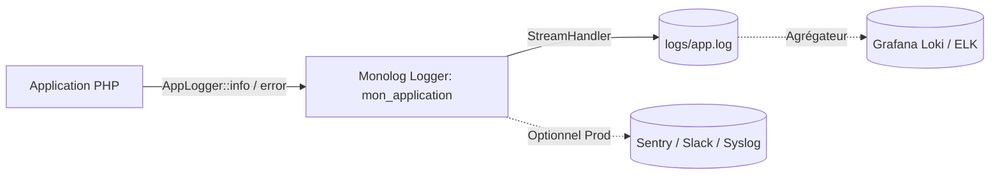

# 📊 Guide d'Observabilité et Journalisation

Ce document décrit l'architecture de journalisation (*logging*), les niveaux d'alerte, la structure des événements et les stratégies de supervision de l'application **Boutique E-commerce PHP 8.3**.

---

## 1. Architecture de Journalisation avec Monolog 3

La journalisation est centralisée via la classe utilitaire [`App\Utils\AppLogger`](file:///c:/Users/Beauchard/Documents/exercicesCS/PHP/project/app/Utils/AppLogger.php), s'appuyant sur la bibliothèque standard de l'industrie **Monolog 3**.



### Caractéristiques :
* **Canal par défaut** : `mon_application` (configurable via `LOG_CHANNEL` dans `.env`).
* **Fichier de destination** : [`logs/app.log`](file:///c:/Users/Beauchard/Documents/exercicesCS/PHP/project/logs/app.log) (configurable via `LOG_FILE`).
* **Format des entrées** : Format textuel enrichi de métadonnées JSON :
  ```text
  [2026-10-07T23:02:45.683941+00:00] mon_application.ERROR: Échec de connexion {"email":"inconnu@mail.com"} []
  [2026-10-07T23:02:45.693241+00:00] mon_application.INFO: Nouvel utilisateur inscrit {"id":42} []
  ```

---

## 2. Niveaux de Log et Matrice des Événements

| Niveau | Utilisation dans l'Application | Contexte Associé | Exemple de Message |
| :--- | :--- | :--- | :--- |
| **`CRITICAL`** | Panne d'infrastructure bloquante | `host`, `db_name`, `error`, `code` | `Erreur de connexion à la base de données` |
| **`ERROR`** | Échec d'authentification ou erreur d'upload | `email`, `erreur` | `Échec de connexion` |
| **`WARNING`** | Anomalie de sécurité, validation ou 404 | `uri`, `method`, `user_id`, `id` | `Route non trouvée (404)`, `Jeton CSRF invalide`, `Produit supprimé` |
| **`INFO`** | Événement métier normal et significatif | `id`, `user_id`, `commande_id`, `total` | `Nouvel utilisateur inscrit`, `Connexion réussie`, `Nouvelle commande passée avec succès` |
| **`DEBUG`** | Informations détaillées de débogage | `payload`, `time` | `Requête SQL exécutée`, `Paramètres reçus` |

---

## 3. Configuration et Filtrage par Environnement

Le niveau minimum de capture est configurable dynamiquement via le fichier `.env` ou les variables système du conteneur :

```ini
# En développement (capture tout à partir de DEBUG)
LOG_LEVEL=DEBUG

# En production (capture uniquement à partir d'INFO ou WARNING)
LOG_LEVEL=INFO
```

---

## 4. Stratégie de Rotation des Fichiers de Logs

Pour éviter la saturation de l'espace disque en production :

### Option A : `RotatingFileHandler` de Monolog
Dans [`App\Utils\AppLogger`](file:///c:/Users/Beauchard/Documents/exercicesCS/PHP/project/app/Utils/AppLogger.php), le handler peut être remplacé en production par `RotatingFileHandler` pour conserver un nombre fixe de jours (ex: 14 jours) :
```php
use Monolog\Handler\RotatingFileHandler;

$logger->pushHandler(new RotatingFileHandler($logPath, 14, $level));
```

### Option B : Utilitaire système Linux `logrotate`
Sur un serveur VPS ou conteneur hôte :
```text
/var/www/html/logs/*.log {
    daily
    missingok
    rotate 14
    compress
    delaycompress
    notifempty
    create 0640 www-data www-data
}
```

---

## 5. Intégration dans une Pile de Centralisation (ELK / Grafana Loki)

Les logs générés au format standard Monolog peuvent être directement collectés par :
1. **Promtail & Grafana Loki** : Déploiement d'un agent Promtail monté sur le volume `./logs` pour ingérer les événements en temps réel.
2. **Filebeat & Elasticsearch** : Parsing automatique des contextes JSON pour indexation et création de tableaux de bord Kibana.
3. **Alerting temps réel** : Déclenchement d'alertes webhook (Slack/Discord/PagerDuty) sur tout événement de niveau `CRITICAL` ou fréquence anormale de `Échec de connexion`.
